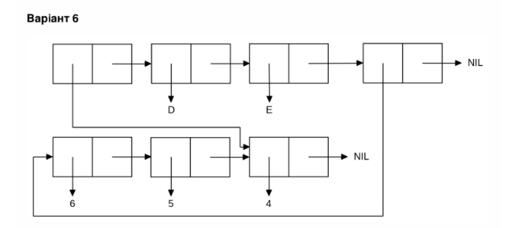

## МОНУ НТУУ КПІ ім. Ігоря Сікорського ФПМ СПіСКС

### Звіт з лабораторної роботи 1
 "Обробка списків з використанням базових функцій"
 дисципліни "Вступ до функціонального програмування"

**Студент**: *Петраш Павло Степанович КВ-13*


**Рік**: *2025*

## Загальне завдання:
1. Створіть список з п'яти елементів, використовуючи функції LIST і CONS . Форма створення списку має бути одна — використання SET чи SETQ (або інших допоміжних форм) для збереження проміжних значень не допускається. Загальна кількість елементів (включно з підсписками та їх елементами) не має перевищувати 10-12 шт. (дуже великий список робити не потрібно). Збережіть створений список у якусь змінну з SET або SETQ . Список має містити (напряму або у підсписках): хоча б один символ хоча б одне число хоча б один не пустий підсписок хоча б один пустий підсписок
2. Отримайте голову списку.
3. Отримайте хвіст списку.
4. Отримайте третій елемент списку.
5. Отримайте останній елемент списку.
6. Використайте предикати ATOM та LISTP на різних елементах списку (по 2-3 приклади для кожної функції).
7. Використайте на елементах списку 2-3 інших предикати з розглянутих у розділі 4 навчального посібника.
8. Об'єднайте створений список з одним із його непустих підсписків. Для цього використайте функцію APPEND.

**Код завдання:**
```
;;створення списку
(defvar my-list ())   
(setq my-list (list 's 1 (list 'c 2) () 'symbol))
(format t "~a~%" my-list)

;;голова списку
(format t "Head: ~a~%" (first my-list))

;;Хвіст списку
(format t "Tail: ~a~%" (cdr my-list))

;;третій елемент списку
(format t "3rd elevent: ~a~%" (nth 2 my-list))

;;останній елемент списку
(format t "Last element: ~a~%" (first (last my-list)))

;;Предикати ATOM та LISTP
(format t "Is 1st Atom?: ~a~%" (atom (first my-list)))
(format t "Is 3rd Atom?: ~a~%" (atom (nth 2 my-list)))
(format t "Is 5th Atom?: ~a~%" (atom (nth 4 my-list)))
(format t "Is 1st List?: ~a~%" (listp (first my-list)))
(format t "Is 3rd List?: ~a~%" (listp (nth 2 my-list)))
(format t "Is 5th List?: ~a~%" (listp (nth 4 my-list)))

;;Порівняння
(format t "Is 3rd an 4th eaqual?: ~a~%" (equal (nth 2 my-list) (nth 3 my-list)))
(format t "Is 2nd > 0?: ~a~%" (plusp (nth 1 my-list)))

;;Об'єднання списків
(defvar sub-list (nth 2 my-list))
(defvar comb-list (append my-list sub-list))
(format t "Merging lists: ~a~%" comb-list)
```
**Результат:**
```
(S 1 (C 2) NIL SYMBOL)
Head: S
Tail: (1 (C 2) NIL SYMBOL)
3rd elevent: (C 2)
Last element: SYMBOL
Is 1st Atom?: T
Is 3rd Atom?: NIL
Is 5th Atom?: T
Is 1st List?: NIL
Is 3rd List?: T
Is 5th List?: NIL
Is 3rd an 4th eaqual?: NIL
Is 2nd > 0?: T
Merging lists: (S 1 (C 2) NIL SYMBOL C 2)
```
## Завдання за варіантом 14:
Створіть список, що відповідає структурі списку, наведеній на рисунку (за варіантом).
Для цього допускається використання не більше двох форм конструювання
списку на "верхньому рівні". Але аргументами цих форм можуть бути рехультати
інших викликів форм конструювання списків.



**Код програми:**
```
;головне завдання
(format t "Main task: ~%")
(defvar main-list)
(setq sub-list (list 6 5 4))
(setq main-list (list (last sub-list) 'd 'e sub-list))
(format t "~a~%" main-list)
```

**Результат:**
```
Main task: 
((4) D E (6 5 4))
```


